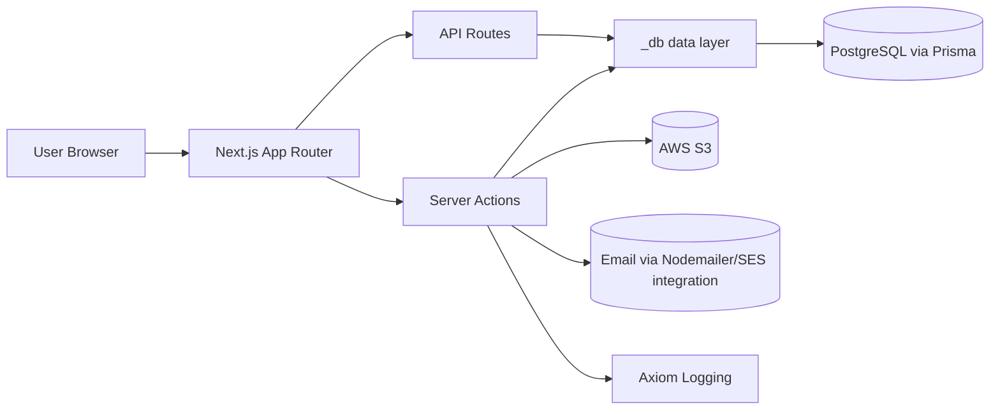
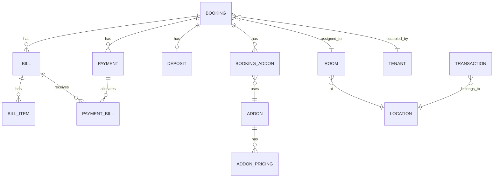
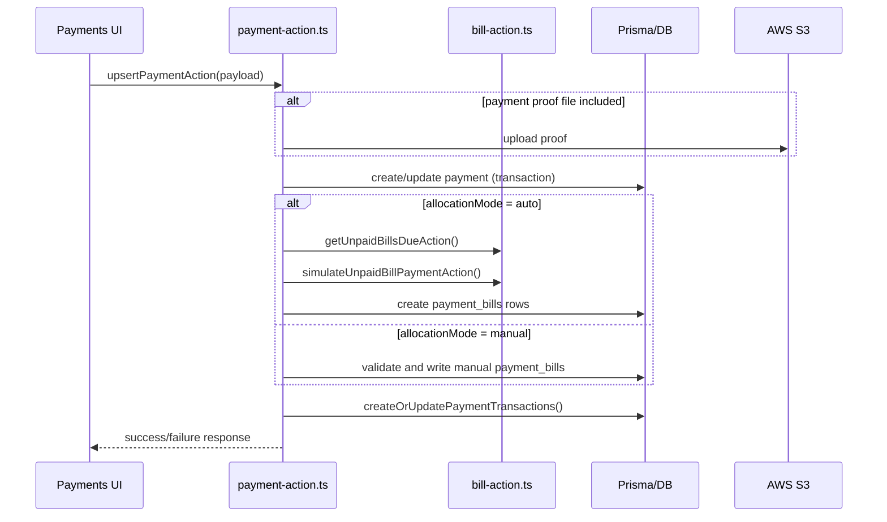

# HMS Architecture Guide

This document explains how HMS is structured and how core business flows work.

---

## 1) High-level architecture



### Layers

1. **Presentation/UI**: pages/components under `src/app`.
2. **Action/API layer**: server actions in feature folders + route handlers in `src/app/api`.
3. **Data access layer**: `src/app/_db/*`.
4. **Persistence**: Prisma schema + PostgreSQL.
5. **Integrations**: S3 (files), email transport, logging.

---

## 2) Next.js route grouping

- `(external)` route group: auth pages (`/login`, `/register`, etc.).
- `(internal)` route group: protected app.
- `(dashboard_layout)` nested group: actual business modules (bookings, payments, bills, deposits, rooms, financials, settings, etc.).

Auth/guard behavior:

- internal layout checks session; redirects to `/login` if unauthenticated.
- dashboard layout also checks setup flag; redirects to `/first-time-setup` if needed.

---

## 3) Core domain model (simplified)



### Important modeling choices

- `PaymentBill` is a junction table representing how a payment is distributed to one/many bills.
- Deposit is separate entity with status machine and references in bill items / transactions.
- `Transaction.related_id` (JSON) stores links like `payment_id`, `booking_id`, `deposit_id`.
- Add-ons support tiered pricing intervals and full-payment mode.

---

## 4) Request flow (example: create payment)



What makes this flow non-trivial:

- Allocation and transaction records are kept in sync.
- Deposit and regular income are split from bill-item composition.
- Editing a payment can trigger recalculation for all affected payments in a booking.

---

## 5) Booking and billing logic

### Fixed-term bookings

- Duration is mapped to calculated end date.
- Overlap checks ensure no active conflicting booking in same room.
- Bills are generated for defined period.

### Rolling bookings

- `is_rolling=true` means recurring monthly behavior.
- Initial bill generation can create historical/current bills from start date to current month.
- Monthly cron creates next bill only when needed.
- End-of-stay scheduling converts rolling to non-rolling and trims future billing.

---

## 6) Deposit lifecycle behavior

Supported statuses:

- `UNPAID`
- `HELD`
- `APPLIED`
- `REFUNDED`
- `PARTIALLY_REFUNDED`
- `FORFEITED`

Rules implemented in code:

- Deposit is usually represented as bill item on first bill.
- When deposit payment is recognized, status can move from `UNPAID` to `HELD`.
- `APPLIED` does **not** create additional income (to avoid double counting).
- Refund transitions create expense transactions.

---

## 7) Scheduled jobs architecture

```mermaid
flowchart TD
  C[Cronicle / scheduler] --> MB[/api/cron/monthly-billing]
  C --> ER[/api/tasks/email/invoice-reminder]
  MB --> B[(bills table)]
  ER --> M[mailer transport]
  ER --> EL[(emaillogs table)]
```

- Cron endpoints use `CRON_SECRET` verification.
- Debug endpoints exist to simulate behavior without production writes.

---

## 8) Test strategy

- **Unit tests**: logic-heavy modules (booking lifecycle, payment allocation, deposits, utility functions).
- **Integration tests**: DB-backed behavior via Prisma + test Postgres.
- CI runs both test suites.

---

## 9) Known complexity hotspots

1. Payment editing with reallocation across bills and transactions.
2. Rolling booking mutations that regenerate bills and preserve historical correctness.
3. Deposit accounting consistency (historical migration scripts indicate prior data correction work).
4. Add-on tiered pricing proration across arbitrary booking periods.

When changing these areas, favor tests first and verify financial totals before and after.
